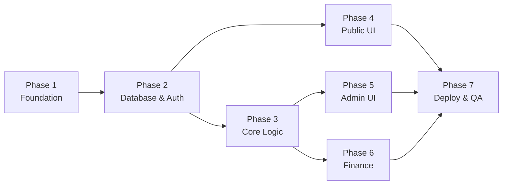

# Roadmap phát triển — World Cup 2026 Prediction & Penalty Fund

> Tài liệu tổng quan chia dự án thành các phase có thứ tự phụ thuộc rõ ràng.  
> Chi tiết từng phase: xem file tương ứng trong folder `docs/`.

---

## Tóm tắt dự án

Ứng dụng web quản lý dự đoán kết quả World Cup 2026, tính điểm, và theo dõi quỹ phạt cho nhóm 10 thành viên. Admin đăng nhập để nhập liệu; người dùng công khai xem read-only.

**Stack:** React (Vite) · TailwindCSS · Zustand · Firebase (Firestore, Auth, Hosting)

---

## Sơ đồ phụ thuộc giữa các phase

---

## Danh sách phase

| Phase | Tên | Mục tiêu chính | Ước lượng | File chi tiết |
| ----- | --- | -------------- | --------- | ------------- |
| 1 | Foundation & Setup | Khởi tạo project, cấu trúc code, routing | 1–2 ngày | [phase-01-foundation.md](./phase-01-foundation.md) |
| 2 | Database & Authentication | Firestore schema, security rules, Auth admin | 2–3 ngày | [phase-02-database-auth.md](./phase-02-database-auth.md) |
| 3 | Core Business Logic | Tính điểm, sao, phạt; services layer | 2–3 ngày | [phase-03-core-logic.md](./phase-03-core-logic.md) |
| 4 | Public UI | Trang công khai read-only | 2–3 ngày | [phase-04-public-ui.md](./phase-04-public-ui.md) |
| 5 | Admin UI | Dashboard admin, CRUD matches & predictions | 3–4 ngày | [phase-05-admin-ui.md](./phase-05-admin-ui.md) |
| 6 | Finance & Penalty Tracking | Quỹ phạt, giao dịch, thanh toán | 2 ngày | [phase-06-finance.md](./phase-06-finance.md) |
| 7 | Seed Data, Deploy & QA | Mock data, tối ưu, hosting, kiểm thử | 2–3 ngày | [phase-07-deploy-qa.md](./phase-07-deploy-qa.md) |

**Tổng ước lượng:** ~14–20 ngày làm việc (1 developer fullstack)

---

## Milestone theo thứ tự ưu tiên

### M1 — Có thể chạy local (cuối Phase 2)
- Admin login được
- Firestore có dữ liệu members + matches mẫu
- Security rules hoạt động

### M2 — Logic đúng (cuối Phase 3)
- Unit test / manual test cho `calculateScore` và `calculatePenalty`
- Cập nhật kết quả trận → điểm & phạt tự tính

### M3 — MVP usable (cuối Phase 5)
- Admin nhập dự đoán và kết quả end-to-end
- Public xem lịch thi đấu và bảng xếp hạng

### M4 — Production-ready (cuối Phase 7)
- Deploy Firebase Hosting
- Seed đầy đủ, UI responsive, quy trình admin mượt

---

## Thành viên (10 người — seed cố định)

Hoa Le · Kien Pham Duc · Minh Triet · Phuc (Leopard) · Huy Tue · tran quoc dat · Tu Anh Vu Duc · Duoc Thai · Thanh Thao Nguyen · Nhan Pham

---

## Tài liệu tham chiếu

- [OVERVIEW.md](./OVERVIEW.md) — Spec gốc đầy đủ
- Phase 1 → 7 — Kế hoạch triển khai chi tiết
