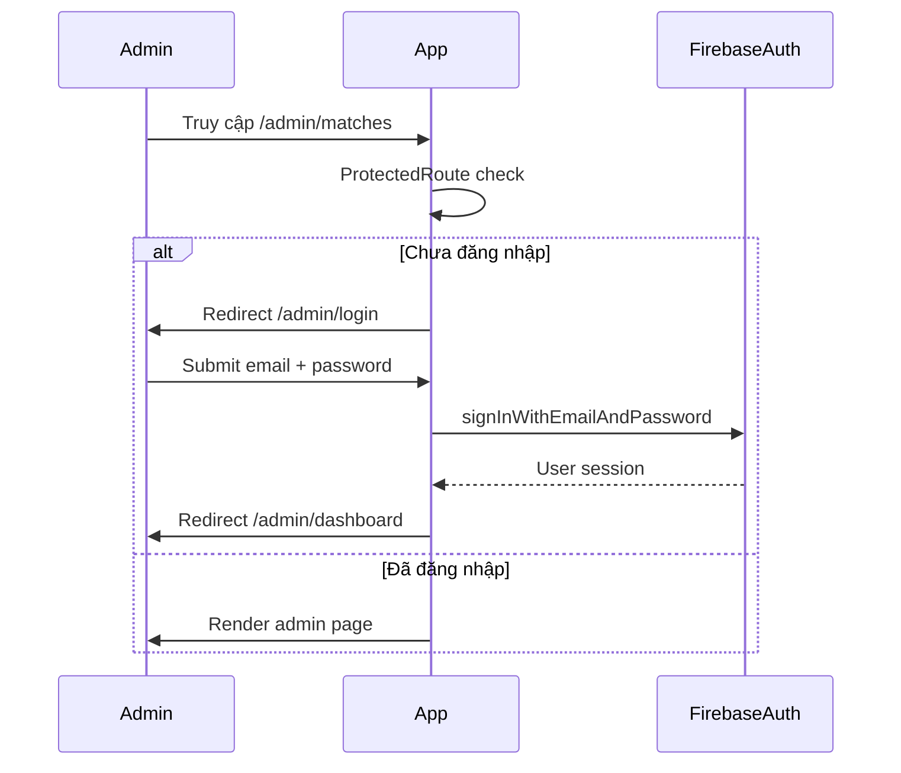

# Phase 2 — Database & Authentication

**Trạng thái:** Hoàn thành  
**Phụ thuộc:** [Phase 1 — Foundation](./phase-01-foundation.md)  
**Ước lượng:** 2–3 ngày  
**Milestone M1:** Admin login được, Firestore có members + matches seed, security rules live

---

## Mục tiêu

Thiết lập Firebase project, Firestore collections, security rules, Firebase Auth (admin-only), và seed dữ liệu ban đầu (10 members + lịch thi đấu vòng bảng World Cup 2026).

---

## Deliverables

- [ ] Firebase project tạo trên Console
- [ ] Email/Password Auth bật, admin account mặc định tạo
- [ ] 4 collections: `users`, `matches`, `predictions`, `transactions`
- [ ] Firestore Security Rules deploy
- [ ] Seed script: 10 members + group stage matches
- [ ] `ProtectedRoute` + redirect `/admin/*` → `/admin/login`
- [ ] Auth store (Zustand) + `useAuth` hook
- [ ] Trang `/admin/login` hoạt động end-to-end

---

## Firebase Auth

### Quy tắc

- **Chỉ admin** đăng nhập — không có public user auth
- Provider: Email/Password
- Tài khoản mặc định (tạo thủ công hoặc script một lần):

| Field | Value |
| ----- | ----- |
| Email | `dev.minhphuc@gmail.com` |
| Password | `Sateraito2023@@` |

> **Bảo mật:** Không commit password vào repo. Document trong README dev-only.

### Auth flow



### Implementation tasks

| Task | File |
| ---- | ---- |
| Auth service | `services/auth.service.ts` |
| Auth store | `stores/auth.store.ts` |
| Hook | `hooks/useAuth.ts` |
| Protected route | `components/ProtectedRoute.tsx` |
| Login page UI | `pages/admin/AdminLoginPage.tsx` |
| Logout | Sidebar action → `signOut()` |

---

## Firestore Schema

### Collection: `users`

Document ID: slug hoặc auto-generated (khuyến nghị: `slugify(name)`)

```ts
{
  id: string
  name: string
  totalPoints: number      // default 0
  totalPenalty: number     // default 0
  paidAmount: number       // default 0
  createdAt: Timestamp
  updatedAt: Timestamp
}
```

**Indexes:** Không bắt buộc ban đầu; leaderboard sort client-side hoặc query `orderBy totalPoints desc`.

### Collection: `matches`

Document ID: auto hoặc `{stage}_{homeTeam}_{awayTeam}`

```ts
{
  id: string
  homeTeam: string
  awayTeam: string
  matchTime: Timestamp
  stage: MatchStage
  homeScore: number | null
  awayScore: number | null
  isFinished: boolean      // default false
  createdAt: Timestamp
  updatedAt: Timestamp
}
```

**Indexes đề xuất:**
- `stage` + `matchTime` (composite) — lọc theo vòng
- `isFinished` + `matchTime` — trận sắp diễn ra

### Collection: `predictions`

```ts
{
  id: string
  matchId: string
  userId: string
  predictedHome: number
  predictedAway: number
  isStar: boolean
  createdAt: Timestamp
  updatedAt: Timestamp
}
```

**Indexes đề xuất:**
- `matchId` — lấy dự đoán theo trận
- `userId` + `matchId` (composite, unique logic app-level) — một user một dự đoán/trận

### Collection: `transactions`

```ts
{
  id: string
  userId: string
  amount: number
  type: "penalty" | "payment"
  note: string
  matchId?: string         // optional — link penalty về trận
  createdAt: Timestamp
}
```

**Indexes:** `userId` + `createdAt desc`

---

## Security Rules

Theo spec OVERVIEW — public read, authenticated write:

```js
rules_version = '2';
service cloud.firestore {
  match /databases/{database}/documents {
    match /{document=**} {
      allow read: if true;
      allow write: if request.auth != null;
    }
  }
}
```

**File:** `firestore.rules` + deploy qua Firebase CLI.

**Lưu ý mở rộng (optional, post-MVP):** Validate schema trong rules (field types, required fields) để tránh admin nhập sai format.

---

## Seed Data

### 2.1 Members (10 users)

Seed vào collection `users` với `totalPoints: 0`, `totalPenalty: 0`, `paidAmount: 0`:

1. Hoa Le  
2. Kien Pham Duc  
3. Minh Triet  
4. Phuc (Leopard)  
5. Huy Tue  
6. tran quoc dat  
7. Tu Anh Vu Duc  
8. Duoc Thai  
9. Thanh Thao Nguyen  
10. Nhan Pham  

### 2.2 Matches — Group Stage (World Cup 2026)

**Yêu cầu:** Seed tối thiểu vòng bảng (48-team format WC 2026).

**Cấu trúc:** 12 bảng (A–L), mỗi bảng 4 đội, 6 trận/bảng → 72 trận vòng bảng.

**Nguồn dữ liệu:**
- FIFA official schedule (cập nhật khi có) hoặc
- Placeholder teams + thời gian ước lượng cho dev

**Script:** `scripts/seed.ts` hoặc `scripts/seed.mjs` chạy qua Firebase Admin SDK hoặc client với admin auth.

**Match document mẫu:**

```json
{
  "homeTeam": "Brazil",
  "awayTeam": "Serbia",
  "matchTime": "2026-06-15T00:00:00Z",
  "stage": "group",
  "homeScore": null,
  "awayScore": null,
  "isFinished": false
}
```

**Knockout rounds:** Có thể seed skeleton (empty teams TBD) hoặc thêm ở Phase 5 khi admin CRUD.

---

## Service layer (CRUD cơ bản)

| Service | Methods |
| ------- | ------- |
| `users.service.ts` | `getAll`, `getById`, `updateTotals` |
| `matches.service.ts` | `getAll`, `getByStage`, `getById`, `create`, `update`, `updateResult` |
| `predictions.service.ts` | `getByMatch`, `getByUser`, `create`, `update`, `delete` |
| `transactions.service.ts` | `getByUser`, `create`, `getAll` |

**Firestore optimization (ghi nhận sớm):**
- Batch reads khi load dashboard
- Cache Zustand cho matches list (invalidate khi admin update)
- Tránh N+1: fetch predictions theo `matchId` với `where in` batch

---

## Task checklist chi tiết

### Firebase Console
- [ ] Tạo project Firebase
- [ ] Enable Firestore (production mode)
- [ ] Enable Authentication → Email/Password
- [ ] Tạo admin user
- [ ] Lấy web app config → `.env.local`

### Local dev
- [ ] `firebase init` (Firestore, Hosting, Emulators optional)
- [ ] Cài `firebase-tools` dev dependency
- [ ] Script npm: `"seed": "node scripts/seed.mjs"`

### Auth UI
- [ ] Form login: email, password, error message
- [ ] Loading state khi sign in
- [ ] Persist session (`onAuthStateChanged`)
- [ ] Redirect sau login về URL intended hoặc `/admin/dashboard`

### Testing manual
- [ ] Truy cập `/admin/matches` khi chưa login → redirect login
- [ ] Login sai password → hiển thị lỗi
- [ ] Login đúng → vào admin
- [ ] Public routes `/`, `/matches` không cần auth, đọc Firestore OK

---

## Definition of Done

1. Admin login/logout hoạt động
2. Firestore có 10 users + ≥72 matches group stage
3. Security rules deployed — public read, auth write
4. Services CRUD cơ bản có thể gọi từ console/dev tool
5. Protected routes chặn đúng

---

## Phase tiếp theo

→ [Phase 3 — Core Business Logic](./phase-03-core-logic.md)  
→ [Phase 4 — Public UI](./phase-04-public-ui.md) (có thể song song sau khi services sẵn sàng)
