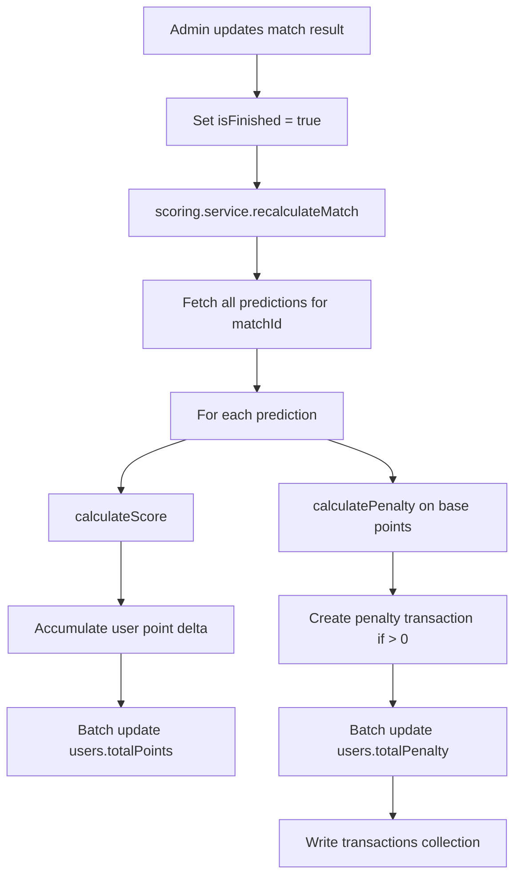

# Phase 3 — Core Business Logic

**Trạng thái:** Hoàn thành  
**Phụ thuộc:** [Phase 2 — Database & Auth](./phase-02-database-auth.md)  
**Ước lượng:** 2–3 ngày  
**Milestone M2:** Tính điểm và phạt chính xác; cập nhật kết quả trận → leaderboard & penalty tự động

---

## Mục tiêu

Implement toàn bộ logic nghiệp vụ: tính điểm dự đoán, cơ chế sao (star), tính phạt quỹ, và pipeline tự động khi admin cập nhật kết quả trận.

---

## Deliverables

- [ ] `utils/score.ts` — `calculateScore()`
- [ ] `utils/penalty.ts` — `calculatePenalty()`, `getPenaltyByStage()`
- [ ] `utils/star.ts` — giới hạn sao theo vòng, validation
- [ ] `services/scoring.service.ts` — orchestrate recalc toàn bộ
- [ ] Trigger recalc khi `updateResult()` trên match
- [ ] Cập nhật `users.totalPoints`, `users.totalPenalty`
- [ ] Tạo `transactions` type `penalty` khi có phạt
- [ ] Unit tests cho edge cases

---

## Quy tắc tính điểm

### Điểm cơ bản

| Điều kiện | Điểm |
| --------- | ---- |
| Đúng kết quả (Thắng/Hòa/Thua) | +3 |
| Đúng tỉ số chính xác | **5** (thay thế 3, không cộng thêm) |

**Xác định kết quả:**
- Thắng home: `homeScore > awayScore`
- Thắng away: `homeScore < awayScore`
- Hòa: `homeScore === awayScore`

So sánh prediction vs result cùng logic.

### Cơ chế Star (nhân đôi)

| Vòng | Giới hạn sao / user |
| ---- | ------------------- |
| Group | 4 |
| Round of 32 | 2 |
| Round of 16 | 2 |
| Quarter | 1 |
| Semi + Third-place | 1 (shared pool — clarify: 1 mỗi vòng semi và third riêng, spec ghi "Semifinal + Third-place: 1" → **1 sao cho cả hai vòng semi+third combined** hoặc 1 mỗi — **implement: 1 cho semi, 1 cho third**) |
| Final | Luôn x2 — **không cần chọn sao** |

**Logic:**

```ts
function calculateScore(
  prediction: { predictedHome: number; predictedAway: number; isStar: boolean },
  result: { homeScore: number; awayScore: number },
  stage: MatchStage
): number {
  const correctResult = isSameOutcome(prediction, result)
  const exactScore =
    prediction.predictedHome === result.homeScore &&
    prediction.predictedAway === result.awayScore

  let points = 0
  if (exactScore) points = 5
  else if (correctResult) points = 3

  if (stage === "final") {
    return points * 2
  }

  if (prediction.isStar) {
    const wrong = points === 0
    if (wrong) return -3
    return points * 2
  }

  return points
}
```

### Penalty star sai

- Dùng sao (trừ final) + dự đoán **sai** (0 điểm trước nhân) → **-3 điểm**
- "Sai" = không đúng kết quả và không đúng tỉ số

---

## Quy tắc quỹ phạt

**Không phạt** khi và chỉ khi user đạt **đúng 5 điểm** (exact score — trước khi nhân star/final).

| Stage | Mức phạt (VND) |
| ----- | -------------- |
| group | 10,000 |
| round32 | 15,000 |
| round16 | 20,000 |
| quarter | 25,000 |
| semi | 30,000 |
| third | 35,000 |
| final | 50,000 |

```ts
function calculatePenalty(points: number, stage: MatchStage): number {
  if (points === 5) return 0  // exact score base points BEFORE multiplier
  return PENALTY_RATES[stage]
}
```

**Lưu ý quan trọng — thứ tự tính:**

1. Tính `basePoints` (0, 3, hoặc 5)
2. `penalty = calculatePenalty(basePoints, stage)` — dựa trên base, **không** dựa trên điểm sau nhân
3. Áp dụng star/final multiplier cho **điểm xếp hạng** riêng

**Ví dụ:**

| Case | Base | Penalty | Score sau star |
| ---- | ---- | ------- | -------------- |
| Exact score, no star | 5 | 0 | 5 |
| Exact score + star | 5 | 0 | 10 |
| Final, exact score | 5 | 0 | 10 (x2 final) |
| Đúng kết quả, group | 3 | 10,000 | 3 |
| Star + sai | 0 → -3 | 10,000 | -3 |
| Đúng kết quả + star | 3 | 10,000 | 6 |

---

## Star validation (khi admin nhập prediction)

```ts
function canUseStar(
  userId: string,
  stage: MatchStage,
  existingPredictions: Prediction[]
): { ok: boolean; reason?: string }
```

- Đếm predictions có `isStar: true` của user trong cùng stage (hoặc stage group)
- Final: reject nếu admin set `isStar: true` (UI disable checkbox)
- Return error nếu vượt limit

---

## Scoring pipeline



### `scoring.service.ts`

| Method | Mô tả |
| ------ | ----- |
| `recalculateMatch(matchId)` | Recalc toàn bộ predictions của 1 trận |
| `recalculateAll()` | Full recalc (dev/debug, sau bulk import) |
| `getUserStarCount(userId, stage)` | Đếm sao đã dùng |

**Idempotency:** Khi recalc lại cùng trận:
- Option A: Xóa penalty transactions cũ của `matchId` rồi tạo mới
- Option B: Lưu `lastCalculatedAt` trên match — **khuyến nghị Option A** cho đơn giản

**Transaction safety:** Dùng Firestore batch write (max 500 ops) hoặc Cloud Function nếu scale.

---

## Edge cases & test matrix

| # | Scenario | Expected score | Expected penalty |
| - | -------- | -------------- | ---------------- |
| 1 | Predict 2-1, Result 2-1, no star | 5 | 0 |
| 2 | Predict 2-1, Result 3-1, no star | 3 | 10k (group) |
| 3 | Predict 2-1, Result 0-0, no star | 0 | 10k |
| 4 | Predict 2-1, Result 0-0, star | -3 | 10k |
| 5 | Predict 1-1, Result 2-2, no star | 3 | 10k |
| 6 | Final: Predict 1-0, Result 1-0 | 10 | 0 |
| 7 | Final: Predict 2-0, Result 1-0 | 6 | 50k |
| 8 | Star + exact score | 10 | 0 |

---

## Unit tests

File: `src/utils/__tests__/score.test.ts`, `penalty.test.ts`

Framework: Vitest (tích hợp Vite)

```bash
npm install -D vitest @testing-library/react
```

**Coverage tối thiểu:** Toàn bộ test matrix trên + star limit validation.

---

## Integration với matches.service

```ts
async function updateResult(
  matchId: string,
  homeScore: number,
  awayScore: number
): Promise<void> {
  await updateMatch(matchId, { homeScore, awayScore, isFinished: true })
  await scoringService.recalculateMatch(matchId)
}
```

Admin UI (Phase 5) gọi duy nhất `updateResult` — không tính tay.

---

## Definition of Done

1. Unit tests pass 100% test matrix
2. Recalculate 1 trận cập nhật đúng 10 users
3. Penalty transactions tạo đúng amount theo stage
4. Star limit enforced khi create/update prediction
5. Final luôn x2, không cần isStar

---

## Phase tiếp theo

→ [Phase 5 — Admin UI](./phase-05-admin-ui.md) (predictions + result input)  
→ [Phase 4 — Public UI](./phase-04-public-ui.md) (hiển thị leaderboard từ data đã tính)
