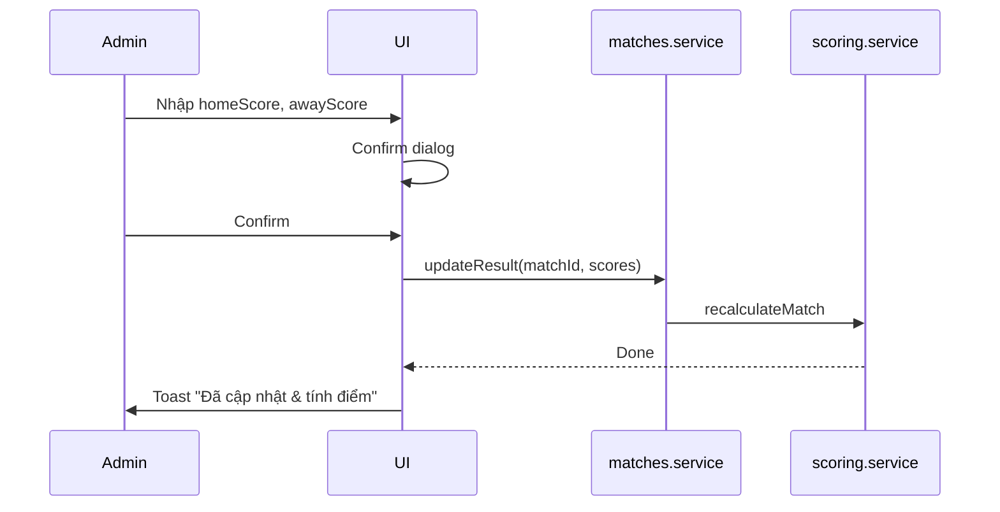

# Phase 5 — Admin UI

**Trạng thái:** Hoàn thành ✅  
**Phụ thuộc:** [Phase 2 — Database & Auth](./phase-02-database-auth.md), [Phase 3 — Core Logic](./phase-03-core-logic.md)  
**Ước lượng:** 3–4 ngày  
**Milestone M3:** Admin nhập dự đoán và kết quả end-to-end; public pages reflect data

---

## Mục tiêu

Xây dựng khu vực quản trị với sidebar layout, CRUD matches, nhập/cập nhật predictions cho 10 members, và cập nhật kết quả trận kích hoạt scoring pipeline.

---

## Deliverables

- [x] `AdminLayout` — sidebar + navbar hoàn chỉnh
- [x] `/admin/dashboard` — tổng quan admin
- [x] `/admin/matches` — quản lý trận + nhập kết quả
- [x] `/admin/predictions` — nhập dự đoán bulk theo trận
- [x] Form validation (star limits, score ranges)
- [x] Confirm dialogs cho actions quan trọng
- [x] Toast notifications success/error

---

## Admin route map

| Route | Chức năng |
| ----- | --------- |
| `/admin/login` | Đăng nhập (Phase 2) |
| `/admin/dashboard` | Stats + quick actions |
| `/admin/matches` | CRUD matches, update result |
| `/admin/predictions` | Nhập/sửa predictions theo match |
| `/admin/finance` | Phase 6 |

---

## AdminLayout

```
┌─────────────┬──────────────────────────────────┐
│  SIDEBAR    │  NAVBAR (page title, user email) │
│             ├──────────────────────────────────┤
│ Dashboard   │                                  │
│ Matches     │         MAIN CONTENT             │
│ Predictions │                                  │
│ Finance     │                                  │
│             │                                  │
│ [Logout]    │                                  │
└─────────────┴──────────────────────────────────┘
```

**Sidebar items:** Icon + label, active state highlight  
**Mobile:** Collapsible hamburger sidebar  
**Logout:** `signOut()` → redirect `/admin/login`

---

## Page specifications

### 5.1 Admin Dashboard (`/admin/dashboard`)

**Stats cards:**
- Tổng trận / trận đã kết thúc / trận chờ kết quả
- Tổng predictions đã nhập / tổng có thể (matches × 10)
- Tổng penalty chưa thu

**Quick actions:**
- "Thêm trận mới" → `/admin/matches?action=create`
- "Nhập dự đoán" → `/admin/predictions`
- "Trận cần cập nhật kết quả" — list matches `isFinished=false` và `matchTime < now`

**Recent activity (optional):**
- 5 transactions gần nhất

### 5.2 Admin Matches (`/admin/matches`)

**List view — table:**

| Actions | Thời gian | Trận | Vòng | Kết quả | Trạng thái |
| ------- | --------- | ---- | ---- | ------- | ---------- |
| Edit / Result / Delete | ... | A vs B | group | 2-1 | Finished |

**Actions:**
- **Create:** Modal/form — homeTeam, awayTeam, matchTime, stage
- **Edit:** Sửa thông tin trận (chưa finished)
- **Update Result:** Modal — homeScore, awayScore → gọi `updateResult()` → trigger scoring
- **Delete:** Chỉ nếu chưa có predictions (hoặc cascade delete với confirm)

**Update Result flow:**



**Validation:**
- Scores ≥ 0, integer
- Không update result nếu đã finished (trừ khi có "Recalculate" override với confirm)

### 5.3 Admin Predictions (`/admin/predictions`)

**UX pattern — Match-first bulk entry:**

1. **Chọn trận** — dropdown/search: "Brazil vs Serbia — Group — 15/06 2026"
2. **Hiển thị grid 10 members** — mỗi row:

| Member | Home | Away | ⭐ Star | Stars left |
| ------ | ---- | ---- | ------ | ---------- |
| Hoa Le | [2] | [1] | [ ] | 3/4 |
| ... | | | | |

3. **Save all** — batch write predictions
4. **Star counter** — real-time `canUseStar()` per user per stage

**Rules enforced in UI:**
- Final: star checkbox **disabled** (auto x2)
- Star limit: disable checkbox + tooltip khi hết quota
- Một user một prediction per match — upsert logic
- Predicted scores: 0–99 reasonable max

**Bulk import (optional nice-to-have):**
- Paste CSV: `memberName, home, away, star`
- Parse và validate

**Edit existing:**
- Load predictions for selected match
- Pre-fill form values

---

## Form & validation summary

| Field | Rules |
| ----- | ----- |
| homeTeam, awayTeam | Required, non-empty string |
| matchTime | Required, future or past OK |
| stage | Enum MatchStage |
| predictedHome/Away | Integer ≥ 0 |
| isStar | Check star limit; disabled on final |
| homeScore, awayScore (result) | Integer ≥ 0, required on finish |

**Library suggestion:** React Hook Form + Zod schema

---

## Admin-specific components

| Component | Mô tả |
| --------- | ----- |
| `AdminSidebar` | Navigation + logout |
| `AdminNavbar` | Page title, user info |
| `MatchForm` | Create/edit match |
| `ResultForm` | Update scores modal |
| `PredictionGrid` | 10-row bulk entry |
| `StarCheckbox` | With limit tooltip |
| `ConfirmDialog` | Destructive actions |
| `Toast` | Success/error feedback |

---

## Error handling

| Scenario | UX |
| -------- | -- |
| Firestore write fail | Toast error + retry |
| Star limit exceeded | Inline field error |
| Update result on unfinished predictions missing | Warning "Chưa nhập đủ 10 dự đoán" (warn only, không block) |
| Network offline | Banner "Mất kết nối" |

---

## Task checklist

- [x] AdminLayout responsive
- [x] Admin dashboard stats + quick links
- [x] Matches CRUD complete
- [x] Update result → scoring pipeline
- [x] Predictions match selector + grid
- [x] Star limit validation live
- [x] Confirm trước khi update result
- [x] Toast notifications
- [ ] E2E manual: create match → add predictions → update result → check public leaderboard

---

## Definition of Done

1. Admin workflow đầy đủ: match → predictions → result → scores visible on public
2. Star limits enforced
3. Final không cho chọn star
4. Protected routes — chỉ admin authenticated
5. Không có regression public read-only pages

---

## Phase tiếp theo

→ [Phase 6 — Finance & Penalty Tracking](./phase-06-finance.md)
